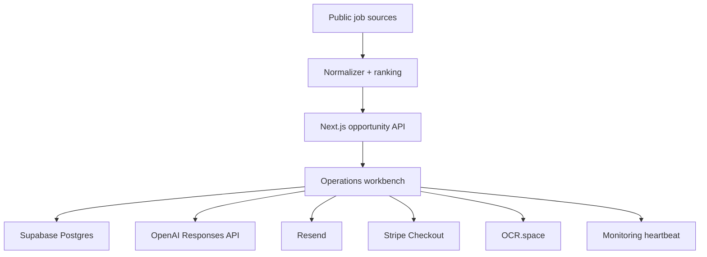

# Freelance OS · AI Opportunity Workbench

A production-oriented freelance operations workbench for discovering opportunities, persisting client/project state, generating grounded proposals, sending transactional email, creating payment checkout sessions, OCR-ing client documents, and exposing health/monitoring signals.

## Production capabilities

- Live public opportunity discovery from Remotive and GitHub
- Persistent client/project/document/proposal/payment/audit data in Supabase Postgres
- Server-side OpenAI Responses API for grounded proposal drafting
- Resend transactional email delivery
- Stripe Checkout for client payments
- OCR.space document text extraction
- Optional monitoring heartbeat webhook plus `/api/health`
- Bearer-token protection for non-public operational APIs
- Next.js + TypeScript, automated tests, linting, production builds, Docker and GitHub Actions

## Security model

Production credentials are server-only. Never expose `SUPABASE_SERVICE_ROLE_KEY`, `OPENAI_API_KEY`, `RESEND_API_KEY`, `STRIPE_SECRET_KEY`, `OCR_SPACE_API_KEY`, or `WORKBENCH_API_TOKEN` with a `NEXT_PUBLIC_` prefix.

Supabase tables have RLS enabled and intentionally define no anonymous browser policies. The application talks to Supabase from server routes with the service-role key. Proposal generation is explicitly instructed not to invent credentials, clients, metrics, dates, tools, or outcomes. External email/payment actions remain explicit API calls rather than hidden automatic submission.

## Production setup

1. Create a Supabase project and execute `supabase/schema.sql`.
2. Copy `.env.example` values into the server/Vercel environment.
3. Configure a verified sender/domain in Resend.
4. Add Stripe secret key and success/cancel URLs.
5. Add OpenAI and OCR.space API credentials.
6. Generate a strong random `WORKBENCH_API_TOKEN`.
7. Optionally configure `MONITOR_HEARTBEAT_URL` for uptime/event collection.
8. Deploy and verify `GET /api/health` returns HTTP 200 with every check `ok: true`.

Until those external resources and credentials are configured, the repository is production-capable code but the corresponding third-party operations cannot truthfully be called live.

## Operational APIs

- `GET /api/opportunities` — live public opportunity feed
- `GET|POST /api/projects` — persistent project store (Bearer token)
- `POST /api/ai/proposal` — grounded proposal generation + persistence (Bearer token)
- `POST /api/email/send` — Resend email + audit event (Bearer token)
- `POST /api/payments/checkout` — Stripe Checkout + payment record (Bearer token)
- `POST /api/ocr` — OCR + extracted document persistence (Bearer token)
- `GET /api/health` — production dependency readiness

## Run locally

```bash
npm ci
npm run dev
```

For only the public opportunity feed, provider credentials are not required. Production operational routes require the server-side variables listed in `.env.example`.

## Quality checks

```bash
npm test
npm run lint
npm run build
docker build -t ai-freelance-workbench .
```

## Architecture



## 中文说明

这是一个面向真实外包业务流程的 AI 工作台代码库：机会发现、客户/项目持久化、基于已验证事实生成方案、邮件发送、Stripe 收款、OCR 文档识别以及运行健康检查都通过服务端真实接口实现。

真实生产运行仍然必须配置外部资源与密钥：Supabase、OpenAI、Resend、Stripe、OCR.space，以及工作台访问 Token。没有这些外部账户/凭据时，我不会把相应能力宣称为“线上已接通”。

## License

MIT
