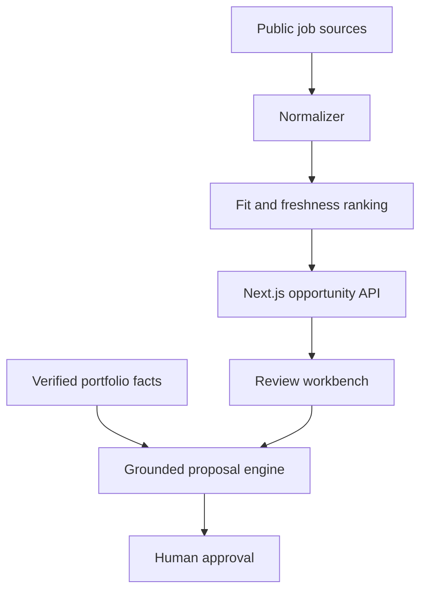

# Freelance OS · AI Opportunity Workbench

A privacy-safe portfolio project showing how an AI-assisted freelance pipeline can discover, rank and turn technical opportunities into grounded proposals.

**This public deployment reads live public listings from Remotive and GitHub.** It never inserts fallback opportunities when a source is empty or unavailable. It does not contain résumés, email addresses, application history, OAuth tokens, browser sessions, cookies or production credentials.

## What it demonstrates

- A polished responsive Next.js and TypeScript interface
- Live multi-source opportunity normalization with source health
- Search, source filtering, match explanations and pipeline metrics
- Grounded proposal drafting with an explicit no-invention guardrail
- A public API at `/api/opportunities`
- Automated tests, linting, production builds, Docker and GitHub Actions

## Run locally

```bash
npm ci
npm run dev
```

Open `http://localhost:3000`. No API key is required for demo mode.

## Quality checks

```bash
npm test
npm run lint
npm run build
docker build -t ai-freelance-workbench .
```

## Architecture



Provider adapters run server-side, normalize public results to one opportunity contract, and preserve the original URL. Empty or failed sources are reported honestly instead of being replaced by sample records. See [Architecture](docs/ARCHITECTURE.md) and [API documentation](docs/API.md).

## 中文说明

这是一个隐私安全的 AI 外包机会工作台作品集，展示从多渠道机会发现、统一数据结构、匹配排序，到基于已验证经历生成申请方案的完整流程。

公开版只展示 Remotive 和 GitHub 的实时公开数据；采集失败或没有结果时会明确显示，不会补入虚构岗位。仓库不包含真实姓名、邮箱、简历、投递历史、OAuth 令牌、浏览器 Cookie、会话或生产密钥。

主要能力：

- Next.js、React、TypeScript 全栈开发
- 多来源岗位标准化与筛选
- 技能匹配解释与机会排序
- 不编造经历的 AI 申请方案工作流
- API、自动化测试、CI、Docker 和生产部署

## Security

- Secrets belong only in server-side environment variables.
- `.env*` is ignored except `.env.example`.
- The demo does not persist personal data.
- Proposal claims must come from verified portfolio facts.
- A human approval step remains before any external submission.

## License

MIT
