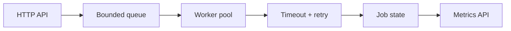

# Distributed Job Runner

[](https://github.com/crz0614/remote-gig-desk-vercel/actions/workflows/portfolio-ci.yml)

A dependency-free Go service for bounded concurrent execution. It demonstrates worker pools, backpressure, idempotent submission, per-attempt deadlines, exponential retry delay, cancellation, graceful shutdown and operational metrics.

## Run

```bash
go test -race ./...
go run ./cmd/server
```

Submit a job:

```bash
curl -X POST http://localhost:8080/jobs \
  -H 'content-type: application/json' \
  -d '{"id":"demo-1","kind":"collect","payload":{"url":"https://example.com"}}'
```

Use the same ID twice to observe idempotency. Set `payload.simulate` to `failure` to exercise retry and terminal failure behavior.

## Endpoints

| Method | Path | Purpose |
|---|---|---|
| `POST` | `/jobs` | Idempotently enqueue work |
| `GET` | `/jobs` | List current jobs |
| `GET` | `/jobs/{id}` | Inspect status and attempts |
| `DELETE` | `/jobs/{id}` | Cancel queued/running work |
| `GET` | `/metrics` | Queue and outcome counters |
| `GET` | `/healthz` | Readiness probe |

## 中文说明

这是一个纯 Go 高并发任务执行服务，展示工作池、队列背压、幂等提交、超时控制、自动重试、任务取消、优雅退出和指标监控。它适用于网页采集、API 集成、自动化任务及数据管道执行器。

## Architecture



The in-memory store keeps the project easy to evaluate. A production deployment can replace it with PostgreSQL and a durable broker while preserving the handler and state contracts.

## Safety

- Request bodies are capped at 1 MiB.
- The queue is bounded and returns `queue full` instead of consuming unlimited memory.
- Attempt deadlines prevent stuck upstream calls.
- Shutdown is bounded by a context deadline.
- The repository contains no credentials or real workload payloads.
